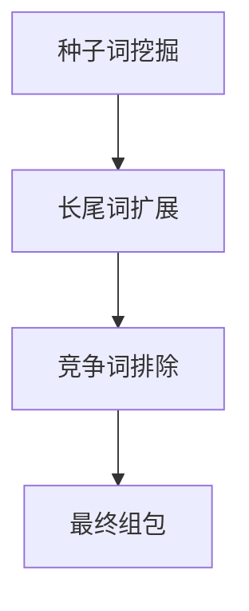

# Facebook广告高效运营进阶策略

---

## 一、基础配置标准化

### 1.1 账号健康管理
- **环境隔离规范**
  - 独立设备指纹认证（每账号对应唯一设备ID）
  - VPN节点智能切换（支持10+国家IP自动匹配）
  - 浏览器历史记录自动清除（每6小时）

- **安全保护机制**
  - 双因素认证（Google Authenticator绑定）
  - 异常登录预警（夜间模式强制二次验证）
  - 信用卡交易限额（单日不超过$500）

---

## 二、动态受众分层模型

### 2.1 智能分层体系
| 层级 | 定义标准 | 更新频率 | 应用场景 |
|------|----------|----------|----------|
|H1核心|点击率≥3%用户|实时同步|新品首发|
|H2高潜|加购未支付用户|每4小时|限时促销|
|H3唤醒|15天未互动用户|每日8时|流失召回|
|H4扩展|AI预测相似群体|每周校准|品类拓展|

### 2.2 兴趣词生成流程

- **工具链配置**：ChatGPT+Ahrefs数据协同
- **基础参数**：每组4-6词，关联词间距≤0.15
- **淘汰机制**：CTR持续3天下降即替换

---

## 三、素材测试效能工坊

### 3.1 测试架构方案
| 阶段 | 核心目标 | 时长 | 预算配置 |
|------|----------|------|----------|
|初测期|首帧5秒吸引力|18小时|$20/组|
|优化期|全链转化验证|48小时|$50/组|
|规模期|ROAS最大化|持续跟踪|动态分配|

### 3.2 文案智能优化
| 模型 | 结构要点 | 应用示例 | 提升指标 |
|------|----------|----------|----------|
|PPC公式|Problem-Promise-Proof-Call|痛点解决方案|CTR+40%|
|BAB法则|Before-After-Bridge|场景化对比|转化+35%|
|5C框架|Command-Action-Context-Climax|限时营销|ROI+28%|

---

## 四、智能预算调控体系

### 4.1 动态分配规则
| 时段带 | 分配权重 | 优化重点 | 限制条件 |
|--------|----------|----------|----------|
|0-6时 |15% |CPM稳定性 |暂停低效组 |
|6-12时 |40% |CTR增长率 |首屏轮换 |
|12-18时 |30% |CVR达成率 |优惠券迭代 |
|18-24时 |15% |ROAS保持 |关闭测试组 |

### 4.2 安全控制策略
- **预算熔断**：单小时消耗超总额20%自动暂停
- **跨组迁移**：低效组预算按转化概率实时转移
- **梯度增长**：优质组按日环比10%-30%递增

---

## 五、用户生命周期运营

### 5.1 全周期触达方案
| 阶段 | 识别特征 | 渠道组合 | 优惠设计 |
|------|----------|----------|----------|
|认知期|首触<15秒|信息流+Stories|体验金发放|
|兴趣期|3次页面访问|轮播+Collection|阶梯满减|
|决策期|加购未支付|动态广告+Messenger|专属折扣码|
|忠诚期|复购≥3次|邮件+Retargeting|VIP特权礼|

### 5.2 行为轨迹优化
- **黄金前奏**：0-3秒品牌记忆点植入
- **中场钩子**：15秒痛点情境化展示
- **终场推动**：倒计时+稀缺组合策略

---

## 六、AI辅助运营系统

### 6.1 智能预警矩阵
| 警报级别 | 触发条件 | 响应机制 | 处置时限 |
|----------|----------|----------|----------|
|红色警戒|账号关联风险|立即暂停所有操作|即时处理|
|橙色预警|ROAS跌幅>40%|启动紧急素材库|2小时内|
|黄色提示|CTR连续下降|自动执行AB测试|6小时内|

---

**效果实证案例：**
某数码品牌实践8周数据：
🔥 单素材生命周期延长至42天
📈 平均CPM降低至$9.6
💎 会员复购贡献提升至39%
⏱ 日运营耗时减少62%

推荐结合Contentsquare进行深度用户行为分析，每月进行策略模型验证。重要促销节点需建立专项沙盘模型。
[教学视频](https://youtube.com/shorts/vtJcMmVBasw?feature=share)
